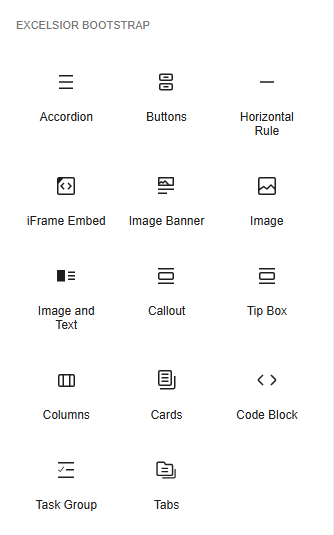

# Excelsior Bootstrap Editor #

**Contributors:** [eslin87](https://profiles.wordpress.org/eslin87/)  
**Tags:** bootstrap, css, js, editor, block  
**Requires at least:** 5.0  
**Requires PHP:** 8.0  
**Tested up to:** 6.8  
**Stable tag:** 1.0.18  
**License:** GPLv2 or later  
**License URI:** https://www.gnu.org/licenses/gpl-2.0.html  

A WordPress plugin that helps with creating Excelsior Bootstrap content pages.

## Description ##

Excelsior Bootstrap Editor enhances the editing experience by providing blocks specifically designed for Excelsior Bootstrap-based content.

## Installation ##

This section describes how to install the plugin and get it working.

### Requirements ###

1. PHP 8.0 is the minimum version you should be using.
1. Gutenberg (or block) editor is enabled.

### Instructions ###

1. Upload the `excelsior-bootstrap-editor` folder to the `/wp-content/plugins/` directory.
1. Activate the plugin through the 'Plugins' menu in WordPress.
1. Look for the Excelsior Bootstrap Editor menu item in the admin menu.

## Screenshots ##

### 1. An example of Excelsior Bootstrap Editor blocks ###

## Changelog ##

### 1.0.18 (07/22/2025) ###

* Fix Image and Text block alignment issue when image size is set to "Actual".
* Update "Failed to load image" message to be clear and with additional information.
* Update packages to the latest.

### 1.0.17 (07/02/2025) ###

* Rework Blockqoute block to allow Image and Text block.

### 1.0.16 (06/18/2025) ###

* Disable back to top button/option when used in a ReBlock. When used in ReBlock, the back to top button will never be triggered and might cause confusion for screen reader users.
* Add `bi-bookmark-star` icon.
* Replace the "play" icon with "bookmark star" icon for the Introduction tab on the module overview pattern.
* Add a new option to Image block to center-align the image.
* Update Excelsior Bootstrap framework.

### 1.0.15 (05/21/2025) ###

* Update Excelsior Bootstrap framework (CSS and JS).

### 1.0.14 (05/14/2025) ###

* Update Excelsior Bootstrap framework (CSS and JS).
* Support Blockquote block for quotation.
* New accordion items are now closed by default on page loads. Added a new toggle control for the editor only to collapse and expand content for editing purposes.
* Add option to change accordion item's header font size.
* Minor fixes and improvements.

### 1.0.13 (04/09/2025) ###

* Remove LMS Common block from the approved block list.
* Add ReBlock block to the approved block list.

### 1.0.12 (04/02/2025) ###

* Bugfix: fix an issue where required fields notice appeared even when they are set after saving/publishing.

### 1.0.11 (03/26/2025) ###

* New: filter by course number and year.
* Move the `images` folder into the `public` folder.
* Allow LMS Common Block to be inside the container.
* Allow iFrame Embed block to be inside the callout and tipbox blocks.
* Update Instructor Notes pattern to include additional contents.
* Update Discussion pattern to include a "Prompt Suggestions" callout for the reply tab.
* Update language on the home page pattern.
* Bugfix: fix an editing issue with iFrame Embed text area.

### 1.0.10 (03/12/2025) ###

* Replace Saturday with Sunday in Overview and Discussion patterns.

### 1.0.9 (02/26/2025) ###

* Add new icons.

### 1.0.8 (01/22/2025) ###

* Add 3 new styles to horizontal rule: basic, red (default), blue, and purple.
* Update Excelsior Bootstrap framework

### 1.0.7 (01/15/2025) ###

* Add new icons.
* Add some hybrid course templates (but not activated).
* Update Instructor Notes template with the reminder box.
* Fix the issue where the tab and accordion items duplicate with the same ID and `show active` classes. This causes an ID conflict, resulting in subsequence tab content being displayed unintentionally.
* Minor fixes and improvements.

### 1.0.6 (12/18/2024) ###

* Add instructor notes patterns
* Fix Get Code button disabled state appearance. It is now more prominent that the button is disabled.
* Remove background colors, preset text colors, and typography settings when creating a Excelsior Bootstrap page. Those settings remain intact when editing outside of Excelsior Bootstrap Editor.
* Allow WordPress's core classic and custom HTML blocks.

### 1.0.5 (12/04/2024) ###

* Remove conflicting responsive classes from floated iframe embed block. Floated element is not responsive by nature because it requires fixed width and height.
* Remove built-in WordPress core block patterns from the editor.

### 1.0.4 (11/20/2024) ###

* Remove unnecessary `role="presentation"` attribute from tabs.
* Remove unnecessary `role="presentation"` attribute from card top image.
* Insert inline Excelsior Bootstrap icon button will only appear in the toolbar for blocks within the Excelsior Bootstrap container when used outside the editor.
* Support up to WordPress version 6.7

### 1.0.3 (11/06/2024) ###

* Excelsior Bootstrap is now available for use in any WordPress post type. To start, insert the "Excelsior Bootstrap" block on to the page.
* Adjust the lock settings for all templates/patterns. Patterns added to new pages will now have the updated lock settings, while existing pages (with patterns added before the release) will remain unchanged.
* Fix an issue where script tags are not properly striped from iframe embed.
* Change "Review" to "Overview" tab content for assignment and discussion patterns/templates. Also, remove repeated expectation and grading information in the "Complete" and "Submit" tabs.
* Change the "list of tasks" under the "Agenda" tab to a basic list for the live session pattern/template.
* Minor backend adjustments

### 1.0.2 (10/23/2024) ###

* Remove the `role` attribute from the `img` tag when the `alt` attribute is empty (indicating the image is decorative). For assistive technologies like screen readers, it's not recommended to add the `role` attribute for decorative images, as it can cause confusion. An empty `alt` tag is sufficient for assistive technologies to recognize the image as decorative.
* Adjust the custom post type capabilities to allow users to delete their own posts, whether they are published or in draft form.
* Add cache-busting technique to the "Get Code" functionality, which should minimize the need for frequent cache purging.
* Fix the issue where the first tab wasn't showing after deleting a tab. Now, when a tab is deleted from a tab group or container, the first tab will correctly apply the necessary classes to ensure it displays properly.
* Add label to horizontal rule icons.
* Add a new Quiz or Knowledge Check template/pattern.

### 1.0.1 ###

* Removed "Welcome to Module #!" header in the Overview pattern.

### 1.0.0 (09/20/2024) ###

* Initial release.
* All Excelsior Bootstrap component, except carousel, tooltip, and popover.