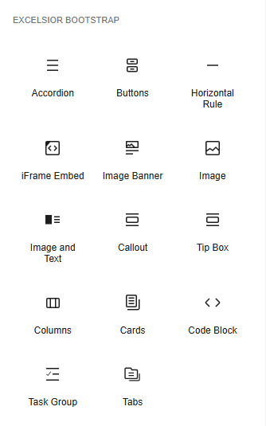

# Excelsior Bootstrap Editor #
**Contributors:** [eslin87](https://profiles.wordpress.org/eslin87/)  
**Tags:** bootstrap, css, js, editor, block  
**Requires at least:** 5.0  
**Requires PHP:** 8.0  
**Tested up to:** 6.9  
**Stable tag:** 1.0.25  
**License:** GPLv2 or later  
**License URI:** https://www.gnu.org/licenses/gpl-2.0.html  

A WordPress plugin that provides custom blocks for creating Excelsior Bootstrap content pages.

## Description ##

Excelsior Bootstrap Editor enhances the block editor by providing custom blocks and patterns specifically designed for creating Excelsior Bootstrap–based content.

## Installation ##

This section describes how to install and activate the plugin.

### Requirements ###

1. PHP 8.0 or higher.
2. The Gutenberg (Block) Editor enabled.

### Instructions ###

1. Upload the `excelsior-bootstrap-editor` folder to the `/wp-content/plugins/` directory.
2. Activate the plugin through the **Plugins** menu in WordPress.
3. Look for the **Excelsior Bootstrap Editor** menu item in the WordPress admin sidebar.

## Screenshots ##

### 1. Example Excelsior Bootstrap Editor blocks in use. ###

## Changelog ##

### 1.0.25 (2026-02-04) ###
* Mobile responsive is toggled on by default for image block.
* Added `core/math` block support.
* Updated discussion pattern/template.

### 1.0.24 (2026-01-14) ###
* Added new icons (`bi-lightbulb`, `bi-building-fill`, and `bi-globe`)
* Added margin bottom spacing to cards, tabs, and accordions.
* Updated instructor notes template.
* Updated Excelsior Bootstrap framework to version 1.0.14.

Previous release changelog can be viewed at https://github.com/excelsior-university-web-systems/excelsior-bootstrap-editor/blob/main/CHANGELOG.md.